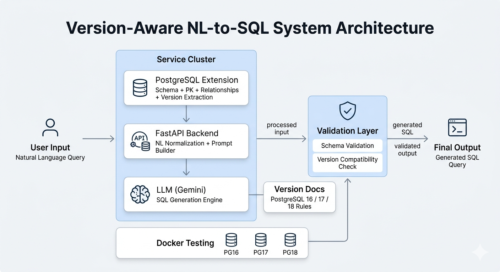

# NL-to-SQL for PostgreSQL

## Why This Project Exists

While learning PostgreSQL, I noticed something important.

The same query can be written in multiple valid ways.  
When using AI to generate SQL, this becomes even more complex.

For example:

> show students whose name starts with A and have orders greater than 5000

An AI model can generate a query.  
But then the real question begins:

- Is this SQL correct?
- Is it aligned with the database schema?
- Does it behave the same across PostgreSQL versions?
- Is the natural language interpretation even correct?

In practice:
- natural language can be ambiguous  
- SQL logic can have multiple valid forms  
- AI can generate incorrect or hallucinated queries  

This project was built to address that gap.

---

## Problem

AI-generated SQL has several real-world limitations:

- ambiguous interpretation of natural language  
- schema mismatches  
- hallucinated tables and columns  
- lack of validation  
- differences across PostgreSQL versions  

---

## Solution

This system introduces a structured approach to NL-to-SQL generation:

1. Extract database schema and relationships
2. Generate SQL using an LLM
3. Validate the generated query
4. Ensure compatibility with PostgreSQL version
5. Test across multiple PostgreSQL environments

---

## System Architecture

<p align="center">
  
</p>

---

## How It Works

### Input

The user provides a natural language query:

```text
show students whose name starts with A and have orders greater than 5000
```


### Output


